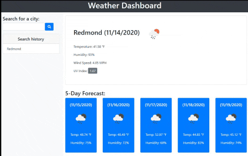

# Weather-Dashboard

## Orlando Baello Homework-6 Weather-Dashboard
### Links
* [Weather-Dashboard - Github Repo](https://github.com/baello2020/Weather_Dashboard)
* [Weather-Dashboard - Github IO](https://baello2020.github.io/Weather_Dashboard/)

### Summary
* HTML and CSS and Javascript documents create a weather application 
* This project emphasizes the use of using an API call and JQuery to make dynamic changes to an HMTL document
* This project utilizes the use of appending HTML pages 

### This project has the following features: 
* A Search bar for the city location
* A card that provides the current weather
    ** Location, Temp, Humidity, Wind Speed, UV Index 
* A Card that provides a five day forecast 

### Features: 
* One HTML Pages
    * Index.html 
        * Contains Search bar and placeholder divs for content
        * internal CSS is used to define a style inside HTML page.
* One Javascript Page
    * script.js

# Acknowledgments

